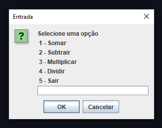
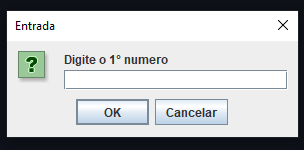
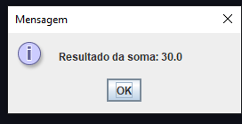

Java Calculator

A simple calculator developed in Java, using JOptionPane for user interaction.

About the Project

This project is a simple Java calculator that allows the user to perform basic mathematical operations through an interactive menu.

The user selects an operation by entering its corresponding number, provides the required values, and receives the calculated result.

All user interaction is handled through JOptionPane dialogs.

Features

The calculator supports the following operations:

Addition
Subtraction
Multiplication
Division
How It Works

When the program starts, a menu displays the available operations.

1 - Addition
2 - Subtraction
3 - Multiplication
4 - Division

The user selects an operation, enters the first number, and then enters the second number.

After processing the operation, the program displays the result.

Technologies
Technology	Purpose
Java	Application development
JOptionPane	User interaction and graphical dialogs

Demonstration
Main Menu

  
  
  

Project Status

Status: Completed

Author

@bryanfs-dev
